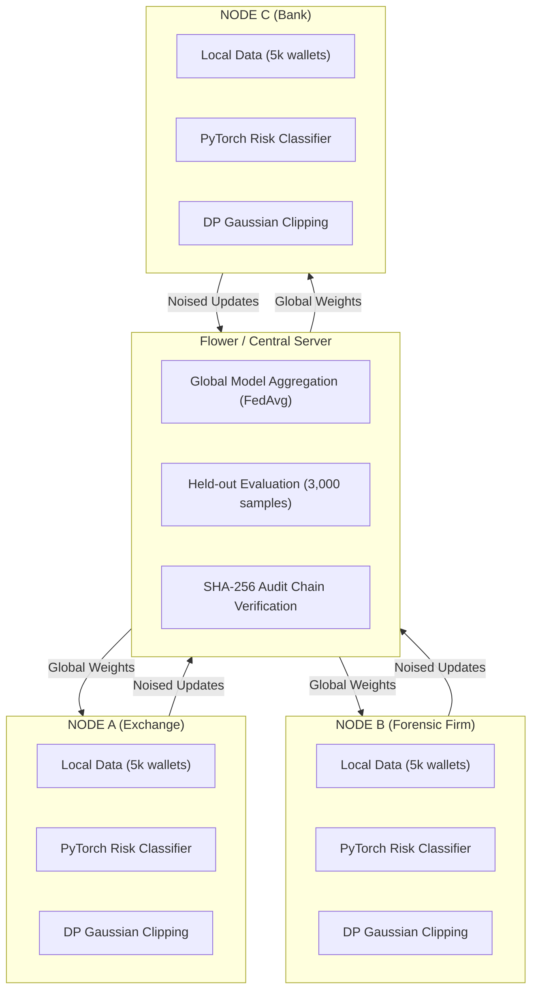

# CipherWatch | Federated Threat Intelligence Console (FTIC)

[](https://opensource.org/licenses/MIT)
[](https://www.python.org/)
[](https://react.dev/)
[](https://flower.ai/)

**CipherWatch** is a privacy-preserving, decentralized fraud detection and Anti-Money Laundering (AML) platform designed for financial institutions, cryptocurrency exchanges, and forensic firms. 

By utilizing **Federated Learning (FedAvg)** combined with **Differential Privacy (DP)**, institutions collaboratively train high-accuracy anomaly detection models across siloed transaction datasets without exposing raw customer financial records. All model parameter updates and round evaluations are anchored to an immutable, cryptographic **SHA-256 Hash Chain** for strict regulatory compliance and auditability.

---

## Bloomberg Terminal-Inspired Console

CipherWatch features a high-density, real-time terminal UI providing live operational threat metrics:

* **Global Accuracy Tracking:** Real-time held-out evaluation across multi-bank test datasets.
* **Hero Syndicate Risk Progression:** Direct visibility into isolated local node blindness vs. unified federated threat detection.
* **Interactive Graph Topology:** Real-time network visualization of cross-institution scam ring wallet clusters and transactional hops.
* **Cryptographic Audit Ledger:** Immutable block-by-block hash-chain verification table.

---

## Key Technical Architecture



* **Federated Model (`model.py`):** Multi-Layer Perceptron (MLP) binary classifier scoring wallet behavior across 8 behavioral dimensions (`tx_count`, `burst_score`, `mixer_hop_score`, `night_activity_ratio`, etc.).
* **Differential Privacy (`dp.py`):** L2-norm gradient clipping and calibrated Gaussian noise addition ensuring (ε, δ)-differential privacy guarantees against model inversion attacks.
* **Graph Entity Resolution (`entity_resolution.py`):** NetworkX-powered cosine similarity graph clustering for resolving fragmented cross-bank scam rings.
* **Audit Hash Chain (`hash_chain.py`):** Tamper-evident ledger linking aggregated weights, evaluation accuracy, and cluster counts into cryptographic blocks.
* **Dashboard API (`main.py` / `state_store.py`):** Asynchronous FastAPI engine broadcasting state updates to the React client.

---

## Quickstart Guide

**Prerequisites**
* Python 3.10+
* Node.js 18+ & npm

**1. Backend Setup**

```bash
# Navigate to backend directory
cd backend

# Create and activate virtual environment
python -m venv .venv
# On Windows PowerShell:
.\.venv\Scripts\Activate.ps1
# On macOS/Linux:
source .venv/bin/activate

# Install dependencies
pip install -r requirements.txt

# Start FastAPI server
python -m uvicorn main:app --reload --port 8000
```

**2. Frontend Setup**

```bash
# In a new terminal, navigate to frontend directory
cd frontend

# Install node dependencies
npm install

# Start Vite dev server
npm run dev
```

Open your browser at `http://localhost:3000` and click **`START RUN <GO>`**.

---

## Distributed Flower gRPC Simulation (Docker)

To run as isolated network containers via Flower gRPC:

```bash
docker compose up --build
```

---

## Security & Privacy Guarantees

* **Zero Raw Data Exchange:** Raw transaction data never leaves local institutional firewalls.
* **Provable Privacy:** Weight updates are bounded by L2 clipping and randomized before egress.
* **Consensus Verification:** Hash chains prevent historical state tampering or aggregation manipulation.

---

## 📜 License

Distributed under the MIT License.
